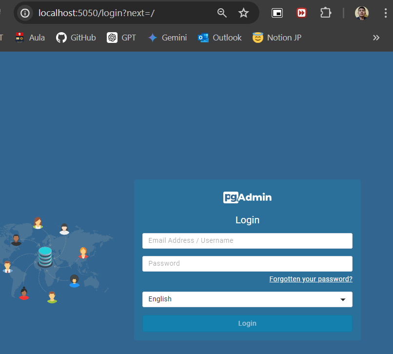
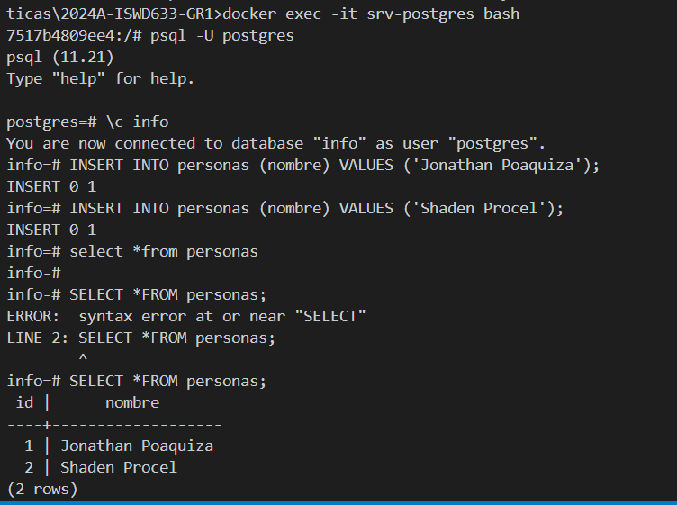

### Crear contenedor de Postgres sin que exponga los puertos. Usar la imagen: postgres:11.21-alpine3.17
Se coloca siempre con contraseña y el username por defecto es postgres.
# docker run -d --name srv-postgres --network postgres-net -e POSTGRES_PASSWORD=mysecretpassword postgres:11.21-alpine3.17  

### Crear un cliente de postgres. Usar la imagen: dpage/pgadmin4

# docker run -d --name srv-pgadmin4 -p 5050:80 --network postgres-net -e PGADMIN_DEFAULT_EMAIL=poaquizajonathan75@gmail.com -e PGADMIN_DEFAULT_PASSWORD=jonathan dpage/pgadmin4

La figura presenta el esquema creado en donde los puertos son:
- a: (completar con el valor)
- b: (completar con el valor)
- c: (completar con el valor)

## Desde el cliente
### Acceder desde el cliente al servidor postgres creado.
# 
### Crear la base de datos info, y dentro de esa base la tabla personas, con id (serial) y nombre (varchar), agregar un par de registros en la tabla, obligatorio incluir su nombre.

## Desde el servidor postgresl
### Acceder al servidor
# docker exec -it srv-postgres sh 
### Conectarse a la base de datos info, la base se creó en la interfaz
# psql -U postgres
# \c info
### Realizar un select *from personas
# 