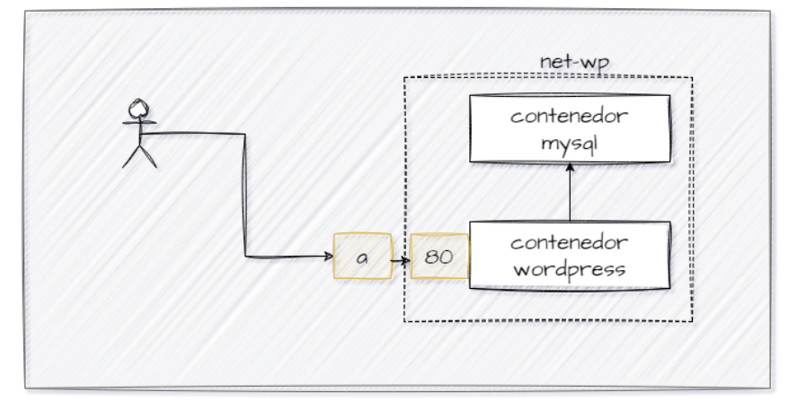
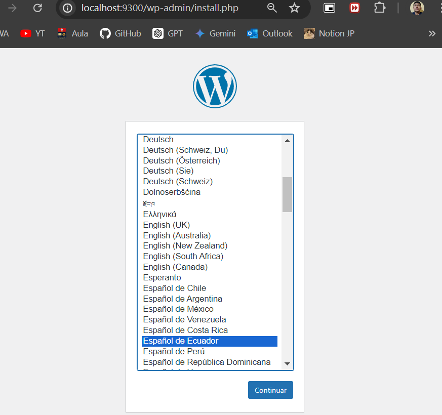
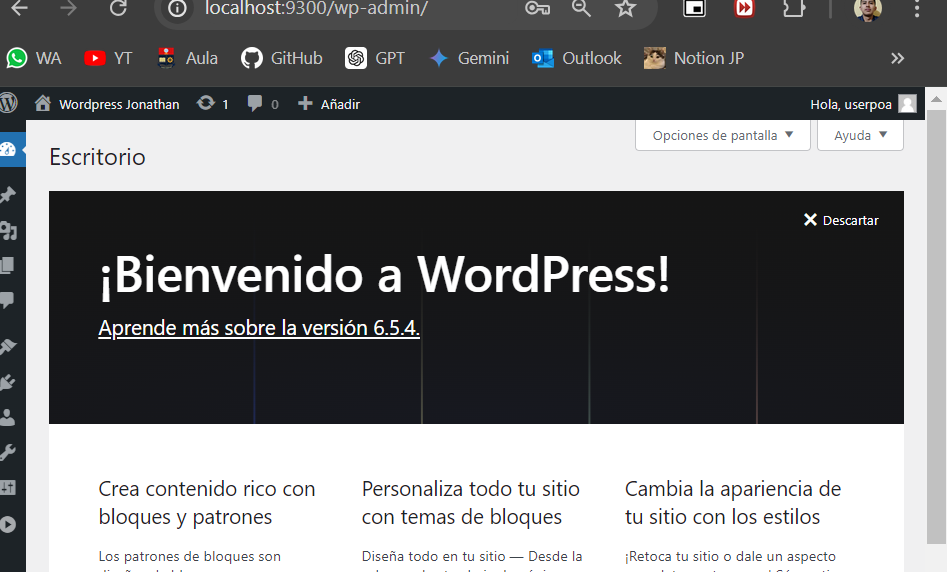
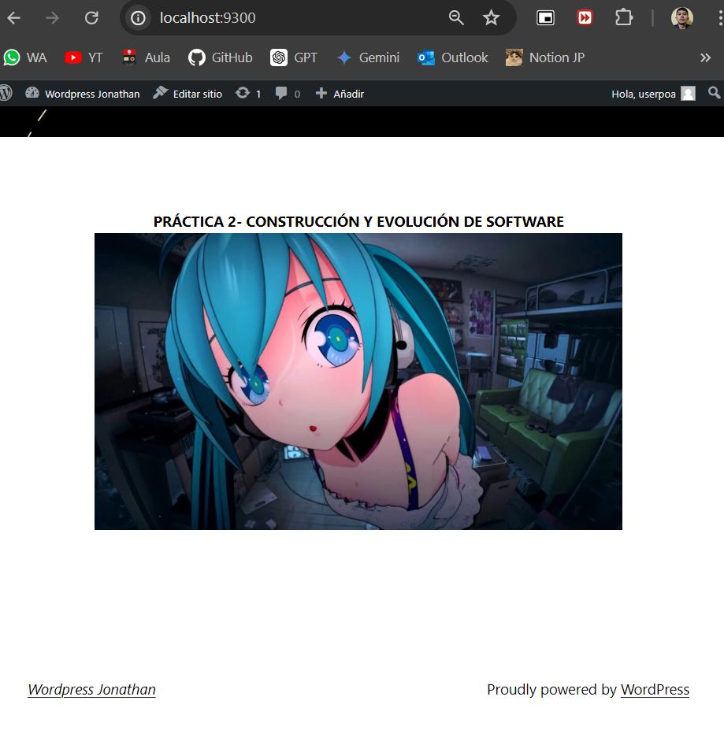
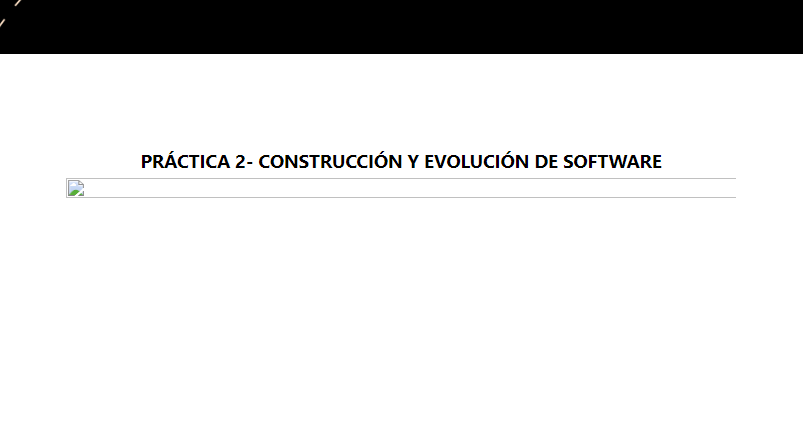

## Esquema para el ejercicio

### Crear la red
# docker network create net-wp
net-wp 
### Crear el contenedor mysql a partir de la imagen mysql:8, configurar las variables de entorno necesarias
# docker run -d --name srv-mysql --network net-wp -e MYSQL_ROOT_PASSWORD=admin -e MYSQL_DATABASE=wordpress -e MYSQL_USER=admin -e MYSQL_PASSWORD=admin mysql:8

### Crear el contenedor wordpress a partir de la imagen: wordpress, configurar las variables de entorno necesarias
# docker run -d -p 9300:80 --name srv-wordpress --network net-wp -e WORDPRESS_DB_HOST=srv-mysql:3306 -e WORDPRESS_DB_NAME=wordpress -e WORDPRESS_DB_USER=admin -e WORDPRESS_DB_PASSWORD=admin wordpress

# misma base de datos: "wordpress" que es la que el servidor de wordpress intentará usar, misma credenciales de acceso, no mapear ningun puerto en el sevidor de mysql, porque en el host de wordpress colocaremos el puerto por defecto de mysql: 3306.

De acuerdo con el trabajo realizado, en la el esquema de ejercicio el puerto a es **9300**

Ingresar desde el navegador al wordpress y finalizar la configuración de instalación.

Desde el panel de admin: cambiar el tema y crear una nueva publicación.
Ingresar a: http://localhost:9300/ 
recordar que a es el puerto que usó para el mapeo con wordpress
# SITO EN DONDE SEA VISIBLE LA PUBLICACIÓN.

### Eliminar el contenedor wordpress
# docker stop srv-wordpress
# docker rm srv-wordpress

### Crear nuevamente el contenedor wordpress
Ingresar a: http://localhost:9300/ 
recordar que a es el puerto que usó para el mapeo con wordpress

### ¿Qué ha sucedido, qué puede observar?
# Si se crea con la misma configuración de red y de base de datos, los cambios que se hicieron en la base de datos se mantienen casi iguales, sin embargo se muestra solo la vista del sitio, sin la posibilidad de editar.

