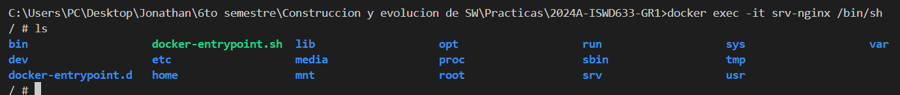
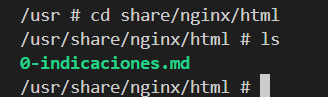

# VOLUMEN TIPO HOST
Un volumen host (o bind mount) es un tipo de volumen donde se monta un directorio o archivo específico del sistema de archivos del host en un contenedor.

```
docker run -d --name <nombre contenedor> -v <ruta carpeta host>:<ruta carpeta contenedor> <imagen> 
```

### Crear un volumen tipo host con la imagen nginx:alpine, para la ruta carpeta host: directorio en donde se encuentra la carpeta html en tu computador y para la ruta carpeta contenedor: /usr/share/nginx/html esta ruta se obtiene al revisar la se obtiene desde la documentación

# docker run -d --name srv-nginx -v "C:\Users\PC\Desktop\Jonathan\6to semestre\Construccion y evolucion de SW\Practicas\2024A-ISWD633-GR1\practica3\nginx\html:/usr/share/nginx/html" nginx:alpine

# La ruta entre comillas

### ¿Qué sucede al ingresar al servidor de nginx?
# Tiene todas las carpetas normales de un servidor nginx


### ¿Qué pasa con el archivo index.html del contenedor?
# Fue reemplazado por el archivo del directorio local. 


### Ir a https://html5up.net/ y descargar un template gratuito, descomprirlo dentro de nginx/html
### ¿Qué sucede al ingresar al servidor de nginx?
# Los cambios realizados en la carpeta host se actualizan automáticamente en la carpeta contenedor.
# ls /usr/share/nginx/html

### Eliminar el contenedor
# docker stop srv-nginx
# docker rm srv-nginx

### ¿Qué sucede al crear nuevamente el mismo contenedor con volumen de tipo host a los directorios definidos anteriormente?
# Se mantienen los cambios, es decir, el volumen no se borró a pesar de haber eliminado el contenedor.

### ¿Qué hace el comando pwd?
# Devuelve la ruta del directorio actual, con la finalidad de ubicarse o conocer específicamente el directorio donde se está trabajando, para no cometer errores al ejecutar comandos en directorios específicos.
Si quieres incluir el comando pwd dentro de un comando de Docker, lo puedes hacer de diferentes maneras dependiendo del shell que estés utilizando.


### Volumen tipo host usando PWD y PowerShell
```
docker run -d --name <nombre contenedor> --publish published=<valorPuertoHost>,target=<valor> -v ${PWD}/<ruta relativa>:<ruta absoluta> <nombre imagen>:<tag> 
```

### Volumen tipo host usando PWD (Git Bash)

```
docker run -d --name <nombre contenedor> --publish published=<valorPuertoHost>,target=<valor> -v $(pwd -W)/html:/usr/share/nginx/html <nombre imagen>:<tag> 
```

### Volumen tipo host usando PWD (en Linux)

```
docker run -d --name <nombre contenedor> --publish published=<valorPuertoHost>,target=<valor> -v $(pwd)/html:/usr/share/nginx/html <nombre imagen>:<tag> 
```

